# 🚀 MaxEndLabs

[](https://youtu.be/aZA5kkqmWxg)

 


------------------------------------------------------------------------

## Live Demo

**🔗 [MaxEndLabs OnlineStore on Render](https://maxendlabstest.onrender.com)**  

**Demo Credentials:**
*Admin*
 - Email: admin@labs.com
 - Password: admin

 *User*
 - Email: test@labs.com
 - Password: admin

 *Stripe Cretid Cart for testing*
 - Cart Number: 5555 5555 5555 4444
 - Date: Any date
 - CVC: Any 3 digits
 
*(Deployed live on Render using a PostgreSQL database. For local development, the application utilizes SQL Server with a zero-configuration automated seeding process (EnsureCreated).)*

------------------------------------------------------------------------

## 📋 Table of Contents

-   [About the Project](#about-the-project)
-   [Technologies Used](#technologies-used)
-   [Prerequisites](#prerequisites)
-   [Getting Started](#getting-started)
-   [Project Structure](#project-structure)
-   [Features](#features)
-   [Usage](#usage)
-   [Configuration](#configuration)
-   [Secret Keys Configuration](#secret-keys-configuration)
-   [Contributing](#contributing)
-   [License](#license)
-   [Contact](#contact)

------------------------------------------------------------------------

## 📖 About the Project

MaxEndLabs is a layered ASP.NET Core (.NET 8) MVC web application that 
simulates a modern e-commerce platform. It enables users to browse 
products, explore detailed product variants, manage a personalized 
shopping cart, and place orders, while administrators can manage the 
product catalog through full CRUD operations and order control.

The application is built using a clean, multi-layered architecture, 
separating the presentation layer (MVC), business logic (services), and 
data access (Entity Framework Core). This structure promotes
maintainability, scalability, and testability while demonstrating best
practices such as service abstraction, dependency injection, and 
Fluent API configurations.

The project also integrates ASP.NET Core Identity for authentication and
user management, providing a solid foundation for role-based access 
control and secure user interactions.

------------------------------------------------------------------------

## 🛠️ Technologies Used

  Technology              Version   Purpose
  ----------------------- --------- ------------------------------------
  ASP.NET Core MVC        8.0       Web framework
  Entity Framework Core   8.0       ORM / database access
  ASP.NET Core Identity   8.0       Authentication and user management
  SQL Server              --        Application database
  Bootstrap               5.x       Frontend styling
  Razor Views             --        Server-side UI rendering

------------------------------------------------------------------------

## ✅ Prerequisites

-   .NET SDK 8.0+
-   Visual Studio 2022 or VS Code
-   SQL Server (LocalDB or full SQL Server)
-   Git

------------------------------------------------------------------------

## 🚀 Getting Started

Follow these steps to get the project running locally.

### 1. Clone the repository

```bash
git clone https://github.com/sg1345/MaxEndLabs
cd MaxEndLabs
```

### 2. Run the application

```bash
dotnet run --project MaxEndLabs
```

------------------------------------------------------------------------

## 📁 Project Structure

    MaxEndLabs.sln
    │
    ├── MaxEndLabs.Data/
    ├── MaxEndLabs.Data.Common/
    ├── MaxEndLabs.Data.Models/
    ├── MaxEndLabs.Services.Core/
    ├── MaxEndLabs.Services.Models/
    ├── MaxEndLabs.Services.Tests/
    ├── MaxEndLabs.ViewModels/
    ├── MaxEndLabs.Web/
    ├── MaxEndLabs.Web.Common/
    └── MaxEndLabs.GCommon

------------------------------------------------------------------------

## ✨ Features

- **Auth & 2FA:** User registration, login, and Google Authenticator (QR code) support.
- **Product Catalog:** Categories, search, and detailed variants.
- **Shopping Cart:** Real-time cart management and Stripe payment integration.
- **Admin Dashboard:** Full CRUD for products/variants and order status management.
- **Bot Protection:** Integrated Google reCAPTCHA for secure forms.
- **Architecture:** Multi-layered project structure with EF Core Code-First

------------------------------------------------------------------------

## 💻 Usage

### Account & Security
* **Access:** Login/Register is required to shop.
* **User Manager:** All users can update profiles and enable **2FA** (Authenticator App/QR Code) for 6-digit security codes.

---

### 👤 Customer Workflow
1. **Shop:** Browse the catalogue and select product.
2. **Cart:** Add, or remove items (only available when logged in).
3. **Checkout:** Create an order and pay securely via **Stripe**.
4. **Orders:** Track personal order history and status on the homepage.

---

### 🛡️ Administrator Workflow
* **Product Management:** Full **CRUD** (Create/Edit/Delete) for products and variants.
* **Order Management:** View all customer orders and update status.
* **Catalogue:** Quick link in the header to view products as they appear to users.
* *Note: Admins cannot use the shopping cart or make purchases.*

---

### 🚦 Quick Access Guide
| Feature | Guest | Customer | Admin |
| :--- | :---: | :---: | :---: |
| Browse Products | ✅ | ✅ | ✅ |
| Shopping Cart | ❌ | ✅ | ❌ |
| Order/Pay | ❌ | ✅ | ❌ |
| Product CRUD | ❌ | ❌ | ✅ |
| Manage 2FA | ❌ | ✅ | ✅ |

---

### 🔐 Administrative access

**Creating, editing and deleting** products and product variants is
restricted to users with the **Admin role**.

The application contains a **pre-seeded administrator account**. To access
the product and variant management functionality, log in with:

-   **Email: admin@labs.com**
-   **Password: admin**

The admin account is seeded automatically when the application starts.

Only users with the Admin role can create, edit and delete products and
product variants.

---

### 👨‍💼 Additional User Access

The application contains a **pre-seeded user account** specifically designed to demonstrate user-facing features without requiring manual data entry.his account comes pre-loaded with a robust history of 30 orders to showcase the application's pagination, sorting, and UI capabilities.

To explore a fully populated customer dashboard, log in with:

-   **Email: test@labs.com**
-   **Password: admin**

------------------------------------------------------------------------

## ⚙️ Configuration

``` json
{
  "DatabaseProvider": "SqlServer",
  "ConnectionStrings": {
    "DefaultConnection": "Server=localhost\\SQLEXPRESS;Database=aspnet_MaxEndLabs_2026;Trusted_Connection=True;Encrypt=False;",
    "PostgresConnection": "Host=dpg-d79vb4k50q8c73b967s0-a;maxendlabs_dbnewgen;Username=maxendlabs_dbnewgen_user;Password=oN6X9w2Qs5l0RCTxj1xRaCHnGLxMLc4I;Port=5432;SSL Mode=Require;Trust Server Certificate=true"
  },
  "Logging": {
    "LogLevel": {
      "Default": "Information",
      "Microsoft.AspNetCore": "Warning"
    }
  },
  "AllowedHosts": "*",
  "GoogleReCaptcha": {
    "SiteKey": "",
    "SecretKey": ""
  },
  "Stripe": {
    "SecretKey": "",
    "PublishableKey": ""
  }
}
```

------------------------------------------------------------------------

## 🤝 Contributing

Fork the repository and create a pull request.

------------------------------------------------------------------------

## 📄 License

MIT License.

------------------------------------------------------------------------

## 📬 Contact

**Dimitar Karabashev** – [https://github.com/sg1345](https://github.com/sg1345)

Project Link: [https://github.com/sg1345/MaxEndLabs](https://github.com/sg1345/MaxEndLabs)

---

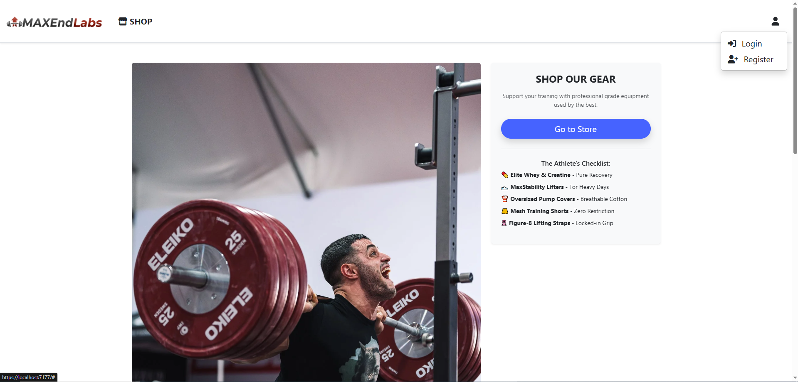
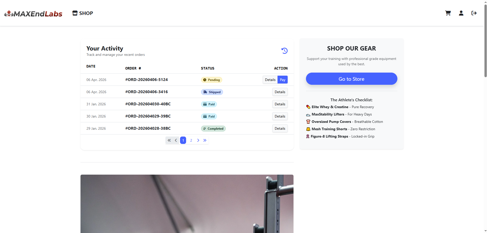
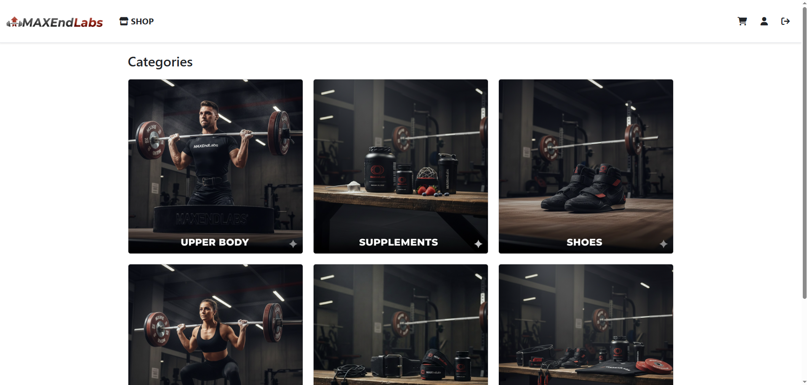
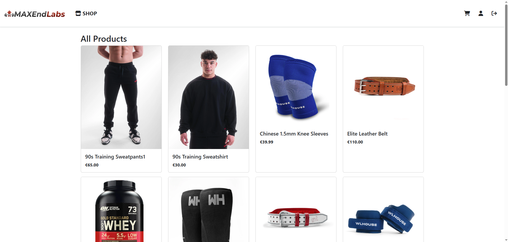
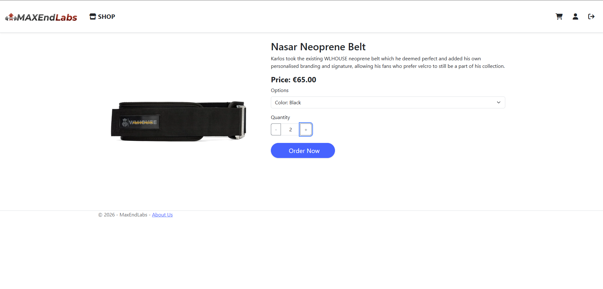
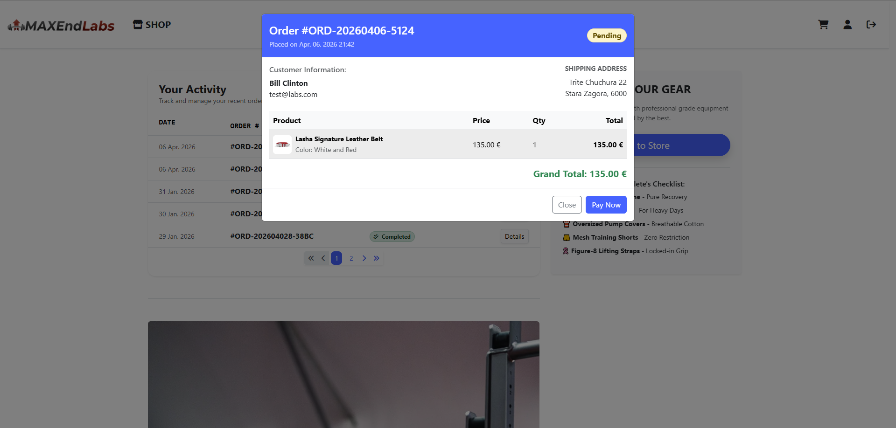
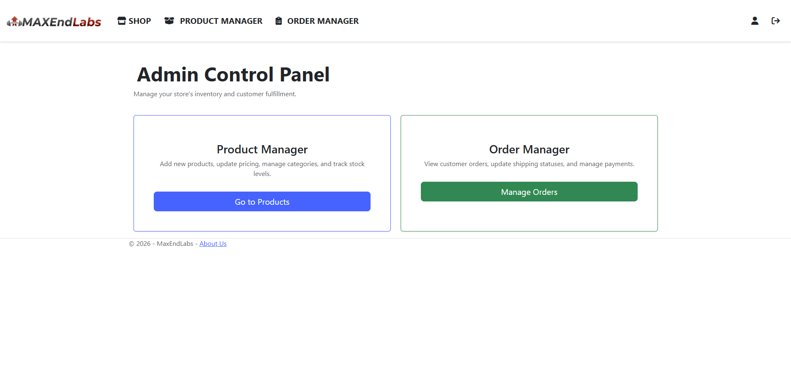
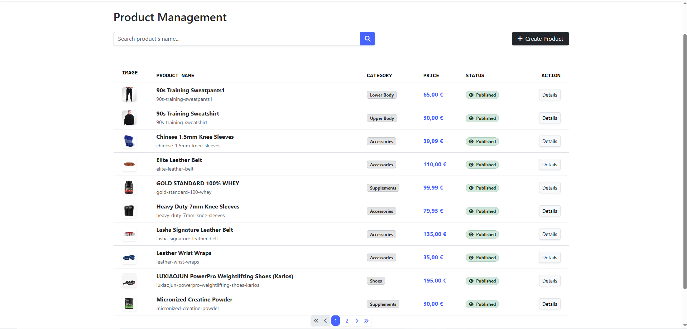
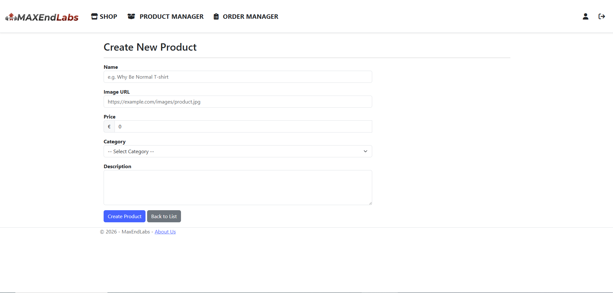
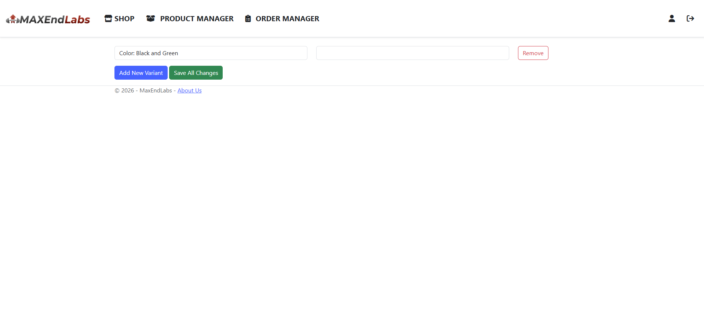
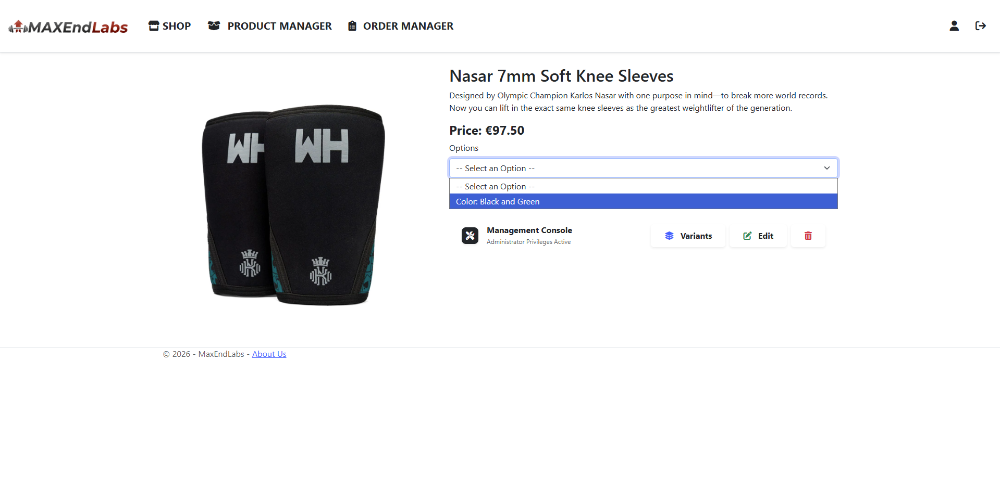
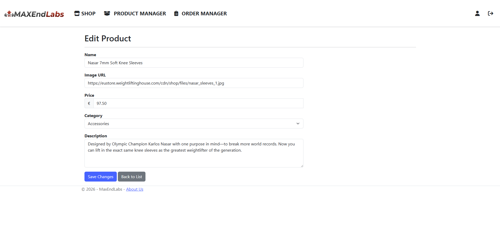
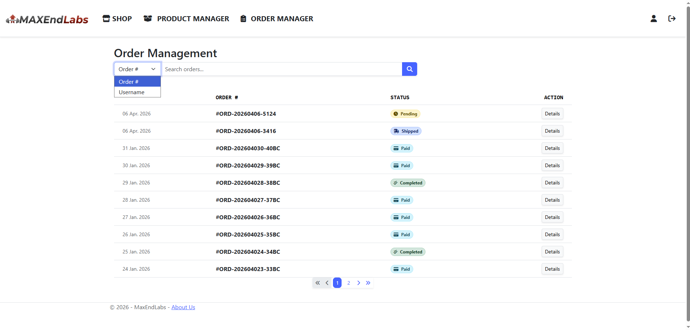
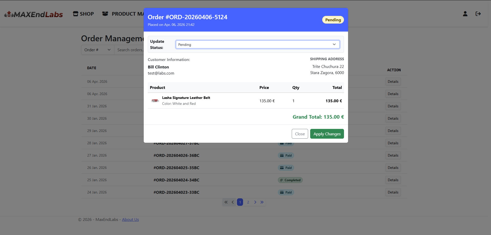